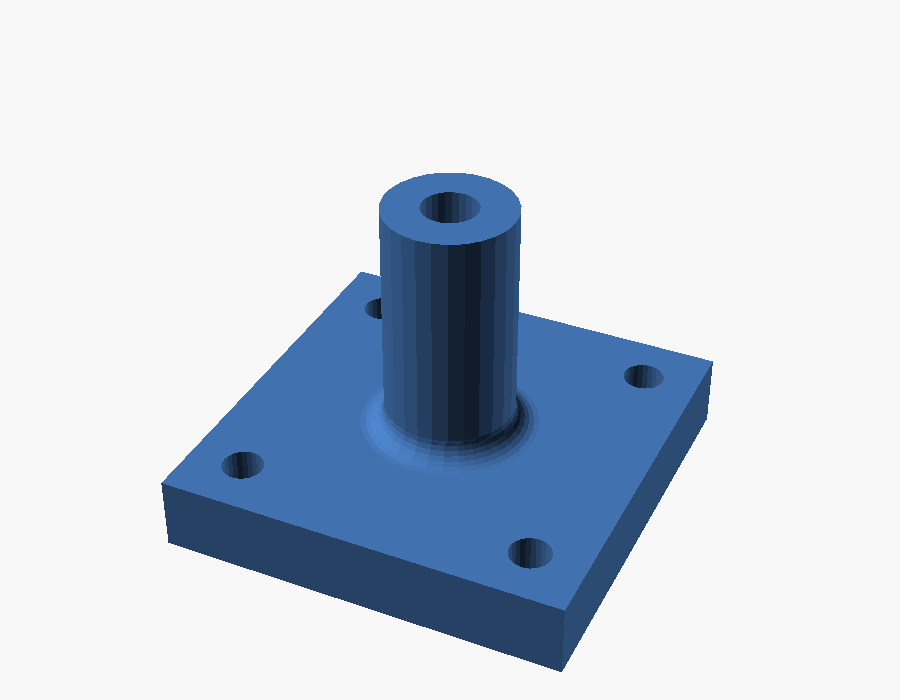
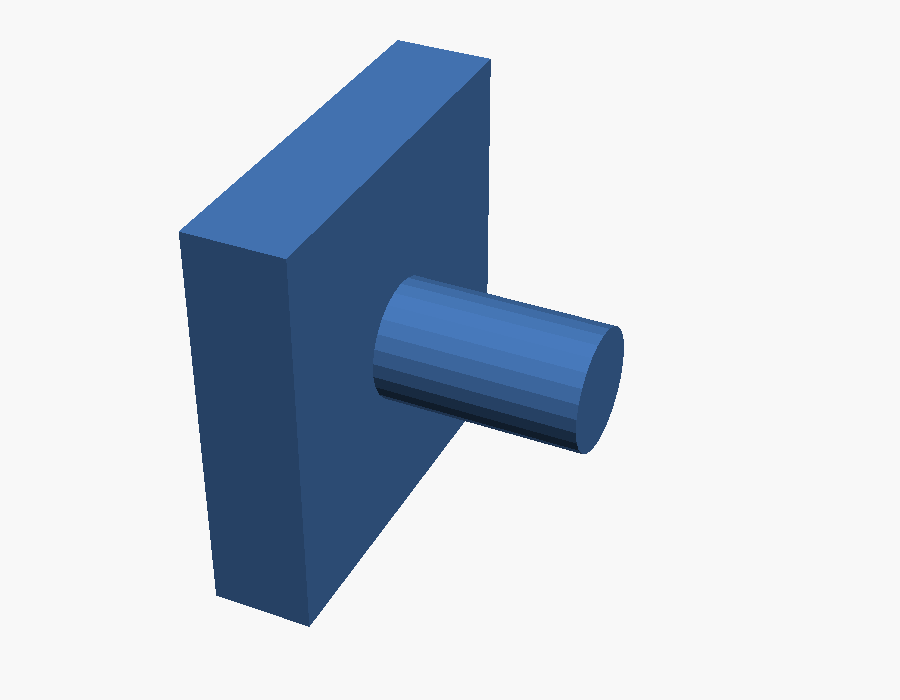
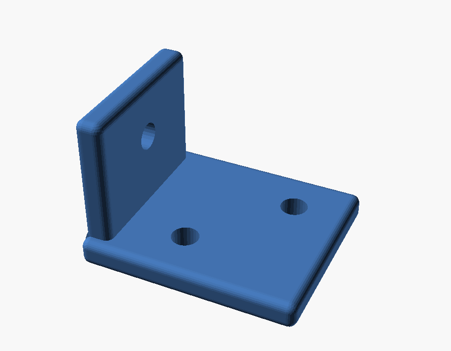
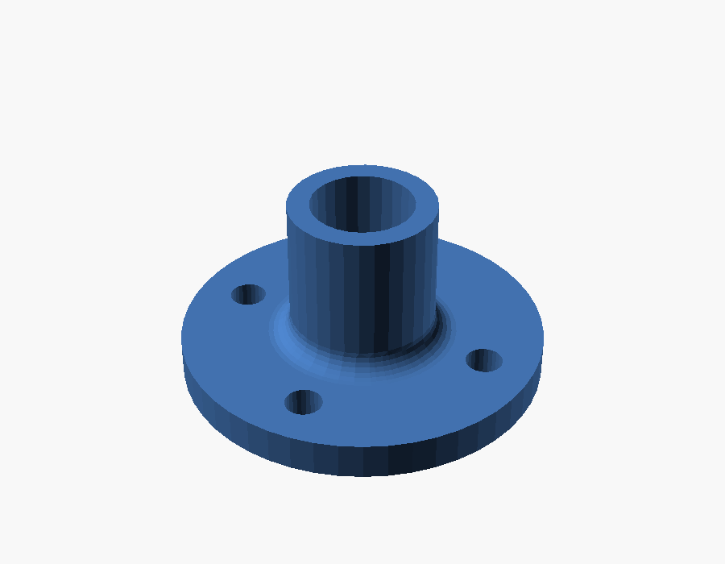
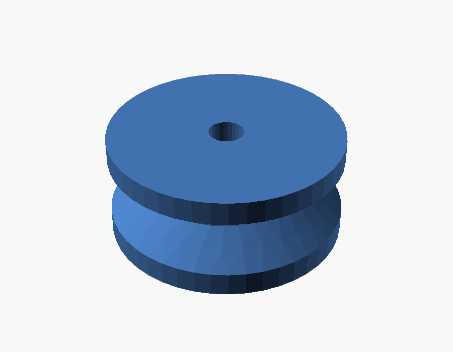
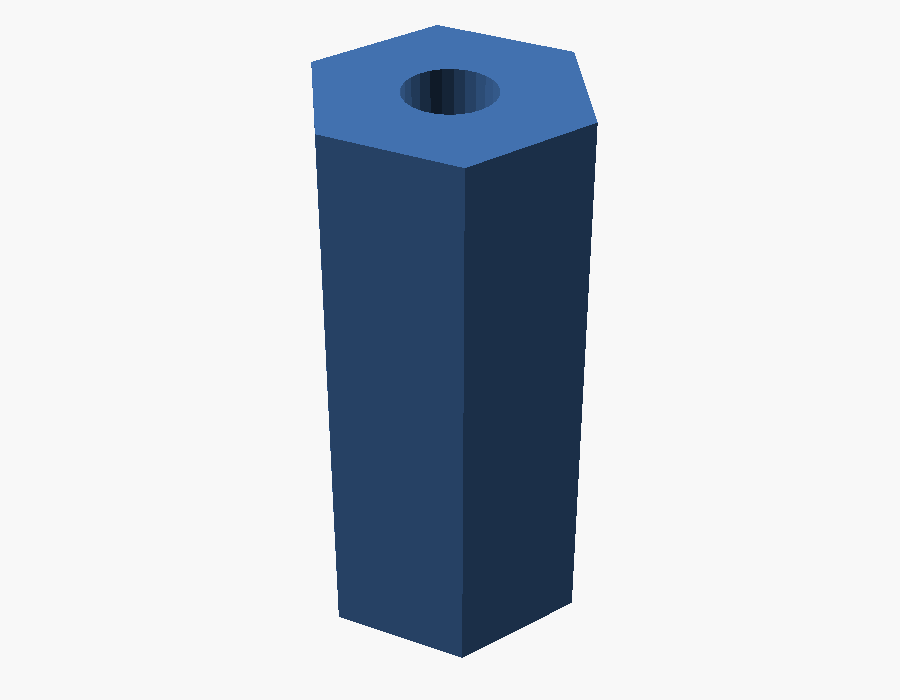

# Examples — why a B-Rep kernel matters

Six real, machinable parts. Each is a single `.scad` file that produces an **exact
STEP solid** (named analytic surfaces — cylinders, cones, tori — not triangles) plus a
mesh STL for preview. Two use **declarative fillets** and two use **declarative
assembly** (`attach`) — neither of which OpenSCAD can express at all. Every STEP here
is verified as a valid single solid (`build/step_check` → `brep_valid=YES`).

Build any of them:

```sh
../build/oscad bracket.scad -o bracket.stl --step bracket.step
```

The headline: open these `.step` files in FreeCAD / Fusion / SolidWorks or hand them to
a machinist's CAM, and they are *real solids with real faces*. OpenSCAD can only give
you a faceted STL — a bag of triangles with no surface a CAM tool can offset, no
cylinder a drill cycle can recognize.

| part | OpenSCAD output | oscad STEP output |
|------|-----------------|-------------------|
| post mount | *can't express* (`attach`+`fillet` unknown) | valid solid; centred post + exact **toroidal** weld |
| dowel wall | *can't express* (`attach` unknown) | valid solid; pin mated to the wall-face centroid |
| pulley | 420 triangles, no surfaces | **8 exact surfaces** (2 cones, 3 cylinders, 3 planes) |
| hex standoff | 48 triangles, no surfaces | **10 exact surfaces** (1 cylinder, planar faces) |
| bracket | *can't express* (`fillet` unknown) | valid solid, 26 cylindrical + 12 spherical fillet faces |
| flange | *can't express* (`fillet` unknown) | valid solid incl. an exact **toroidal** weld fillet |

---

## post mount — declarative assembly (`attach`) + weld fillet



```scad
fillet(2.5, edges = "concave")
  attach(on = "top") {
    cube([plate, plate, thick], center = true);  // parent: gives the frame
    cylinder(h = post_h, r = post_r);            // seated, centred on the top face
  }
// ... minus a bore and four mounting holes
```

**Why it's great.** `attach(on="top")` seats the post on the plate's top face by a
**topology query**, not coordinates — it lands on the *face centroid*, so the post stays
centred no matter how you resize the plate. There is no `translate([...])` replaying the
plate's dimensions; change `plate` and the post follows the face automatically. This is
OpenSCAD's most-felt gap — no local origin for a subassembly — answered directly. Then
`fillet(edges="concave")` welds the junction into an exact `TOROIDAL_SURFACE`. `attach`
is the **constructive dual** of the fillet selection: one query picks *what to round*,
the other picks *where to measure a frame from and mate to*. Both re-resolve against the
freshly-built solid every rebuild — declarative, not a stateful pick.

---

## dowel wall — the `from` override, laid horizontal



```scad
attach(on = "right", from = "bottom") {
  cube([10, 40, 40], center = true);   // the wall (parent)
  cylinder(h = 20, r = 6);             // dowel pin, laid horizontal on the wall face
}
```

**Why it's great.** `on="right"` picks the wall's +X face; `from="bottom"` overrides
which *child* face seats — the cylinder's flat cap — so the pin lies horizontal with its
axis along +X, mated to the wall-face centroid. It also shows the kernel's honesty: a
cylinder has **no planar side face**, so the default (`from="left"`) can't seat it flat
and *fails loud* rather than faking a mate — `from="bottom"` is the correct way to lay it
on its side. Partial operations, surfaced not hidden.

---

## bracket — declarative convex-edge fillet



```scad
fillet(1.5, edges="convex") union() {
  cube([40, 34, thickness]);
  translate([0, 2, 0]) cube([thickness, 30, 28]);
}
// ... minus three mounting holes
```

**Why it's great.** One line — `fillet(1.5, edges="convex")` — rounds *every outer
edge* and leaves the inner corner and the bolt holes sharp. The "which edges" is a
**pure query over the topology**, re-evaluated against the freshly-built solid, not an
interactive pick that breaks when you change a dimension. OpenSCAD has no `fillet` at
all; CadQuery/build123d can fillet but only by imperatively selecting faces. The STEP
carries 26 exact cylindrical edge-blends + 12 spherical corner patches — `valid=YES`.

**Honest footnote** (right in the file): the upright is inset 2 mm so its faces aren't
*coincident* with the base's. Exact B-Rep booleans/fillets are fragile on flush faces —
the first version failed loudly, and insetting is the same fix you'd make in any CAD
package. This is the real edge of the kernel, shown not hidden.

---

## flange — declarative concave (weld) fillet



```scad
fillet(3, edges="concave") union() {
  cylinder(h = 5,  r = 25);   // base disk
  cylinder(h = 25, r = 10);   // riser tube
}
// ... minus a bore and four bolt holes
```

**Why it's great.** `edges="concave"` selects *only* the reentrant junction where the
tube meets the base and rounds it — the classic **fillet weld**. The result is an exact
`TOROIDAL_SURFACE` in the STEP. Convex and concave selectors exactly partition a solid's
edges, so you address inside corners and outside corners independently, declaratively.
No mesh kernel gives you an exact weld fillet; no other DSL gives it to you this simply.

---

## pulley — exact surfaces of revolution



```scad
rotate_extrude()
  polygon([[3,0],[20,0],[20,4],[14,9],[20,14],[20,18],[3,18]]);
```

**Why it's great.** One revolved profile defines the whole part — and the V-groove walls
come out as **true `CONICAL_SURFACE`s**, the rim and bore as **true cylinders**. The bore
is free (the profile's inner radius). OpenSCAD would hand you 420 triangles approximating
those cones; oscad hands a lathe/CAM 8 exact surfaces it can actually cut to.

---

## hex standoff — the `$fn` idiom, exact



```scad
difference() {
  linear_extrude(20) circle(r = 5, $fn = 6);    // exact hexagon
  translate([0,0,-1]) cylinder(h = 22, r = 1.6);// bore
}
```

**Why it's great.** `circle($fn=6)` is honored as an **exact regular hexagon** (six
planar faces), matching OpenSCAD's hexagon idiom — but extruded and bored it exports as a
clean exact STEP spacer (6 hex faces + 2 caps + 1 cylindrical bore), not a faceted
approximation. The SCAD muscle memory carries over; the output is manufacturing-grade.

---

## Verification, and one honest STL caveat

Every `.step` here is checked as a valid single B-Rep solid:

```sh
build/step_check post_mount.step   # -> solids=1 shells=1 brep_valid=YES
```

Worth knowing: the **STEP** (the exact deliverable) is always valid, but the **STL**
of a part with *spherical fillet corners* (e.g. `bracket`) is **not watertight** — it
has a few T-junctions. That's a tessellation artifact, not a solid defect: OCCT meshes
each face independently, and three fillet blends meeting at a box corner don't share
mesh vertices along their seams. A single *ring* fillet (the `post_mount` weld, a torus)
has no such corner and stays watertight. Fixing the STL path (a stitched/healed mesh) is
future work; the exact B-Rep is unaffected, which is the whole point of using OCCT.
